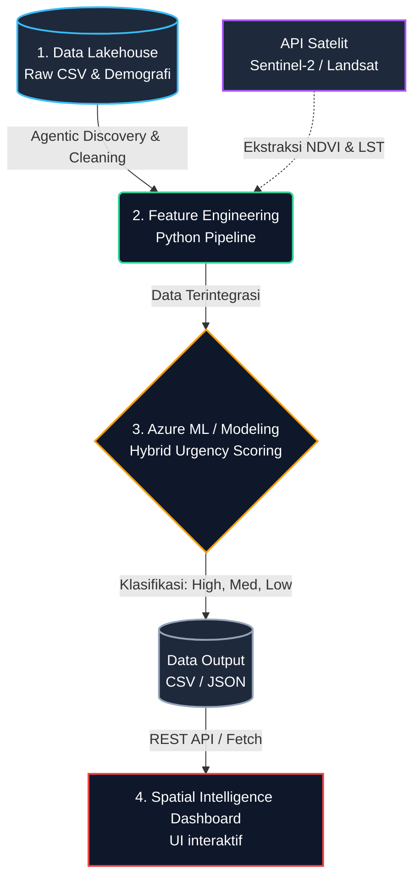

# 📚 Project Encyclopedia: EcoSpatial
**Sistem Intelijen Spasial untuk Mitigasi Krisis Ruang Terbuka Hijau (RTH)**

Dokumen ini merupakan panduan arsitektur dan teknis menyeluruh dari sistem EcoSpatial. Sistem ini dibangun dengan prinsip *Clean Architecture* untuk memastikan skalabilitas, kemudahan pengujian, dan integrasi data yang andal dari sumber hingga ke visualisasi *end-user*.

---

## 🔍 Task 1: Feature Deep-Dive Documentation

Berikut adalah penjelasan fungsionalitas fitur-fitur utama yang menjadi inti dari kecerdasan sistem EcoSpatial:

### 1. Agentic Data Cleaning & Discovery
Sistem secara otomatis membaca data mentah (CSV berantakan) dari sistem penyimpanan *Data Lake* (Microsoft Fabric Lakehouse) pada virtual path `abfss://Antigravity@onelake.dfs.fabric.microsoft.com/Data`. 
Melalui modul utilitas *Name Normalizer*, sistem mengatasi masalah fragmentasi data (misal: "astanaanyar", "astana anyar", "astana_anyar") dan menstandarisasi entitas nama kecamatan. Proses diskoveri ini memastikan bahwa saat data kependudukan dan spasial digabungkan (*join*), tidak ada data yang hilang atau tumpang tindih.

### 2. Remote Sensing Engine (Mesin Penginderaan Jauh)
Sistem ini mengambil alih keterbatasan data survei manual dengan mensimulasikan ekstraksi data satelit (Sentinel-2/Landsat 8). Pipeline ini menghitung dua matriks ekologis utama:
*   **NDVI (Normalized Difference Vegetation Index):** Mendeteksi kerapatan vegetasi hidup untuk mengestimasi rasio RTH aktual secara *real-time*.
*   **LST (Land Surface Temperature):** Memetakan suhu permukaan wilayah untuk mendeteksi anomali *Urban Heat Island* (UHI) pada daerah dengan vegetasi rendah.

### 3. Hybrid Urgency Scoring (Sistem Penilaian Urgensi Hibrida)
Algoritma cerdas yang menggabungkan dua dimensi berbeda: **Data Kependudukan** (demografi/CSV) dan **Data Ekologis** (satelit). 
Sistem menggunakan *weighted scoring model* (misal: bobot RTH 50%, Kepadatan 30%, LST 20%) untuk menghasilkan skor 0-100. Berdasarkan skor ini, setiap kecamatan diklasifikasikan ke dalam:
*   🔴 **HIGH PRIORITY:** RTH kritis (< 17%) & Kepadatan Tinggi.
*   🟠 **MEDIUM PRIORITY:** RTH mendekati ambang batas aman.
*   🟢 **LOW PRIORITY:** RTH memadai (> 25%).

### 4. Spatial Intelligence Dashboard
Antarmuka pengguna interaktif (berbasis `Leaflet.js` & `Chart.js`) yang mengubah data tabular kompleks menjadi wawasan visual yang mudah dicerna:
*   **Heatmap Kepadatan:** Menyoroti pusat kepadatan penduduk di Kota Bandung.
*   **Layer Poligon Urgensi:** Memberikan pemetaan titik buta (blind-spot) krisis RTH yang bisa diklik untuk memunculkan modal metrik detail dan rekomendasi AI.
*   **Grafik Komparatif:** Menampilkan grafik perbandingan antara RTH versi publik (pemerintah) vs RTH hasil deteksi AI (Satelit), serta distribusi *scatter plot* antara LST dan NDVI.

---

## 📂 Task 2: File-by-File Directory Explanation

Struktur direktori EcoSpatial memisahkan antarmuka pengguna, logika bisnis, dan akses data secara tegas untuk mendukung ekosistem *Clean Code*.

| Folder / File | Peran & Deskripsi Fungsional |
| :--- | :--- |
| **`src/repositories/`** | **Abstraksi Akses Data.** Mengimplementasikan *Repository Pattern* (`base_repository.py`, `population_repository.py`, dll). Melalui `lakehouse_backend.py`, file seperti `DataRepository` dan `SatelliteRepository` bertugas mengambil data tanpa membiarkan logika bisnis tahu *bagaimana* data itu diambil (apakah dari API, CSV, atau Database). |
| **`src/services/`** & **`src/models/`** | **Logika Bisnis & AI.** Terdapat `remote_sensing_service.py` untuk mensimulasikan penghitungan NDVI/LST, dan `urgency_classifier.py` (`UrgancyService`) yang mengeksekusi murni logika klasifikasi krisis tanpa campur tangan urusan antarmuka atau database. |
| **`dashboard/`** | **Layer Presentasi (UI).** Memuat file presentasi *frontend* seperti `index.html` (struktur semantik dasbor), `dashboard.css` (gaya antarmuka modern), dan `dashboard.js` (logika *state management*, rendering peta spasial, dan pemanggilan *mock endpoint* dari *backend*). |
| **`data/`** | **Manajemen Data Pipeline.** Terbagi menjadi folder `raw` (tempat CSV mentah dan berantakan berada), `processed` (data setelah proses *cleaning* & normalisasi), dan `outputs` (hasil akhir berupa `ecospatial_master.csv` dan ringkasan `json`). |
| **Root Files** | Berisi file fondasi proyek seperti `requirements.txt` (daftar dependensi seperti Pandas, Numpy), `README.md` (dokumentasi inisiasi), dan file orkestrator utama `src/pipelines/main_pipeline.py`. |

---

## ⚙️ Task 3: Technical Architecture Flow

Alur kerja data EcoSpatial dirancang dengan model pipa (*pipeline*) yang linear dan berkesinambungan. Berikut adalah representasi diagram aliran datanya (*Data Flow Diagram*):

### Penjelasan Alur (*Data Flow*):
1. **Lakehouse (Raw CSV) → Feature Engineering:** 
   Data kependudukan awal diekstraksi dari *Lakehouse* (`abfss://Antigravity`). Data ini dikirim ke layer *Feature Engineering* (Python) untuk dibersihkan (standarisasi nama kecamatan) dan di-*join* secara relasional.
2. **Feature Engineering → Azure ML (Modeling):** 
   Setelah data demografi bersih, sistem memanggil *Remote Sensing API* untuk memperkaya *dataset* dengan atribut lingkungan (NDVI & LST). Data hibrida ini kemudian diumpankan ke model pemrosesan (`UrgancyService` / klasifikasi regresi).
3. **Azure ML (Modeling) → Dashboard (UI):** 
   Model menghitung skor numerik dan label kategori (High/Medium/Low). Hasil akhir (*Data Output*) diekspos dan diambil oleh *frontend* (`dashboard.js`) untuk diterjemahkan menjadi warna poligon interaktif, grafik tren, dan metrik urgensi secara *real-time*.

***
*Dokumentasi ini membuktikan bahwa EcoSpatial bukan sekadar aplikasi antarmuka, melainkan sebuah platform *end-to-end* yang kuat, menjunjung tinggi "Clean Code" lewat Repository Pattern, dan dirancang skalabel untuk diadopsi oleh pemerintah kota secara nyata.*
